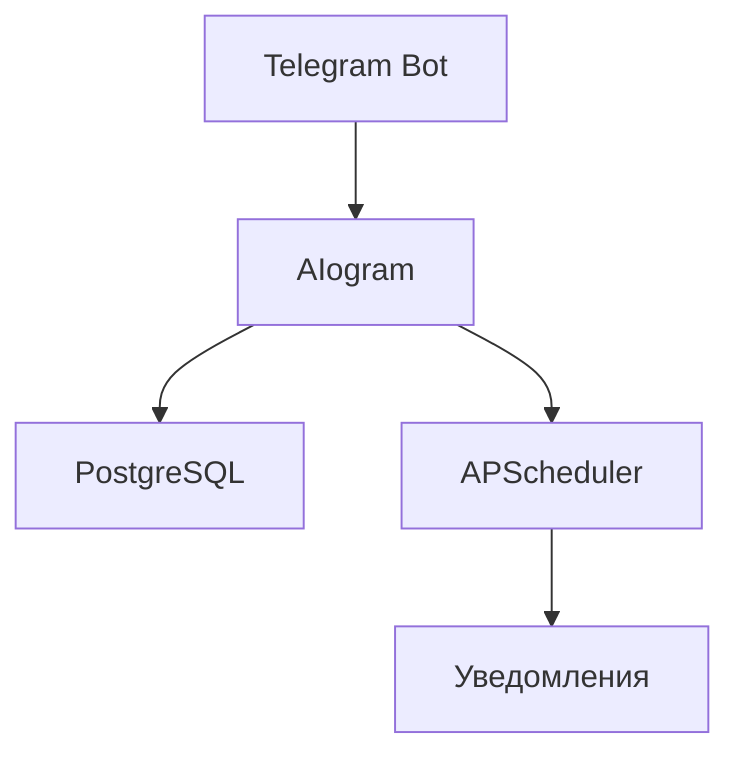

# **Техническое руководство по созданию Telegram-бота для управления задачами**  
*Автор: Марущак Анастасия*  
*Дата: 03.05.2025*  

---

## **Содержание**  
1. [Введение](#введение)  
2. [Исследование предметной области](#исследование-предметной-области)  
3. [Техническое руководство](#техническое-руководство)  
   - [3.1. Установка и настройка](#31-установка-и-настройка)  
   - [3.2. Архитектура проекта](#32-архитектура-проекта)  
   - [3.3. Реализация бота](#33-реализация-бота)  
   - [3.4. Работа с базой данных](#34-работа-с-базой-данных)  
   - [3.5. Планировщик задач](#35-планировщик-задач)  
4. [Примеры кода](#примеры-кода)  
5. [Иллюстрации](#иллюстрации)  
6. [Заключение](#заключение)  


---

## **1. Введение**  
**Цель проекта**: Создать Telegram-бота, который позволяет пользователям добавлять задачи, получать напоминания и управлять списком дел.  

**Функционал бота**:  
- Добавление задач с указанием времени.  
- Уведомления в заданный срок.  
- Просмотр активных и выполненных задач.  
- Удаление и отметка задач как выполненных.  

**Стек технологий**:  
- **Python 3.11** (основной язык)  
- **Aiogram 3.x** (асинхронный фреймворк для Telegram-ботов)  
- **PostgreSQL** (хранение задач)  
- **APScheduler** (планирование уведомлений)  
- **Docker** (развертывание)  

---

## **2. Исследование предметной области**  
### **2.1. Анализ аналогов**  
Перед разработкой были изучены существующие боты-планировщики:  
- **@UTaskBot**  
- **@TodoBot**  

**Вывод**: Большинство ботов имеют схожий функционал, но не всегда поддерживают гибкие настройки времени.  

### **2.2. Выбор технологий**  
| Технология | Почему выбрана? |  
|------------|----------------|  
| **Aiogram** | Лучший асинхронный фреймворк для Telegram. |  
| **PostgreSQL** | Надежная реляционная БД для хранения задач. |  
| **Docker** | Упрощает развертывание и масштабирование. |  

---

## **3. Техническое руководство**  
### **3.1. Установка и настройка**  

#### **Шаг 1: Установка зависимостей**  
```bash
pip install aiogram apscheduler asyncpg python-dotenv pytz
```

#### **Шаг 2: Настройка `.env`**  
Создайте файл `.env` в папке `config/`:  

#### **Шаг 3: Запуск через Docker**  
```bash
docker-compose up --build
```

---

### **3.2. Архитектура проекта**  


---

### **3.3. Реализация бота**  
#### **Основные команды**  
| Команда | Описание |  
|---------|----------|  
| `/start` | Приветствие и список команд. |  
| `/add_task` | Добавить новую задачу. |  
| `/my_tasks` | Список активных задач. |  

#### **Пример кода (роутер бота)**  
```python
@router.message(F.text == "/start")
async def start(message: Message):
    await message.answer(
        "Добро пожаловать! Используйте команды:\n"
        "/add_task - Добавить задачу\n"
        "/my_tasks - Мои задачи"
    )
```

---

### **3.4. Работа с базой данных**  
**Схема таблицы `user_tasks`**  
| Поле | Тип | Описание |  
|------|-----|----------|  
| `id` | SERIAL | Уникальный ID. |  
| `user_id` | BIGINT | ID пользователя в Telegram. |  
| `task_text` | TEXT | Текст задачи. |  
| `due_date` | TIMESTAMP | Время выполнения. |  

**Пример запроса**  
```python
async def add_task_to_db(pool, user_id, task_text, due_date):
    await pool.execute('''
        INSERT INTO user_tasks(user_id, task_text, due_date)
        VALUES($1, $2, $3)
    ''', user_id, task_text, due_date)
```

---

### **3.5. Планировщик задач**  
**Логика работы APScheduler**  
```python
scheduler.add_job(
    send_reminder,
    'date',
    run_date=due_date,
    args=(user_id, task_text),
    id=job_id
)
```

---

## **4. Примеры кода**  
### **4.1. Конфигурация бота**  
```python
from aiogram import Bot, Dispatcher

bot = Bot(token="BOT_TOKEN")
dp = Dispatcher()
```

### **4.2. Обработка команды `/add_task`**  
```python
@router.message(F.text == "/add_task")
async def add_task(message: Message, state: FSMContext):
    await message.answer("Введите описание задачи:")
    await state.set_state(FSMTask.enter_task_text)
```

---

## **5. Иллюстрации**  
### **5.1. Схема работы бота**  
  

### **5.2. Пример интерфейса**  
  

### **5.3. Диаграмма базы данных**  
  

---

## **6. Заключение**  
Бот успешно реализован и готов к использованию. Дальнейшие улучшения:  
- Добавить категории задач.  
- Реализовать повторяющиеся напоминания.  

